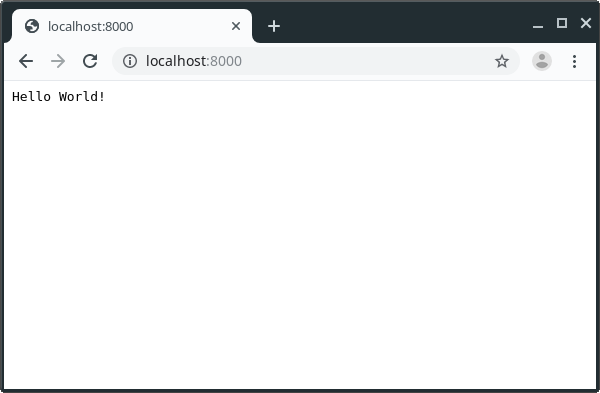

## Basics

### Virtualenv

We will use virtualenv to isolate our dev environment.

```bash
mkdir bocadillo_blog

cd bocadillo_blog

virtualenv .

# after finish installation

source bin/activate
```

Our command line should be like that;

```bash
(bocodillo_blog) [YOUR_USER@YOUR_USER-pc bocodillo_blog]$ 
```

### Installation

You can install bocadillo using the following command

```bash
pip install bocadillo
```

### Extra Installations

You will need sessions to authentication. We will write a decorator for this.

```bash
pip install bocadillo[sessions]
```

## Bocadillo Requirements

You will need Python 3.6 or above versions to use Bocadillo.

## Requirements File

We assume deploy our blog app to our server. We need to add all dependencies into the requirements file.

```bash
pip freeze > requirements.txt
```

### Our First App

We'll create a file called **app.py** using our favorite editor. I prefer Visual Studio Code but you can use yours.

We'll change our project structure later.

```python
from bocadillo import App, configure

app = App()
configure(app)

@app.route("/)
async def index(req, res):
    res.text = "Hello World!"
```

That's all for now. Let's run this command to serve our application.

```bash
uvicorn app:app --reload
```

You don't need to install uvicorn. It's already installed with bocadillo. We used **--reload** flag, because we want to avoid always restart the application by manual.

Our app serving on port 8000 now. Let's open `http://localhost:8000` on our browser.

Yes! we did :)

We saw our **Hello World!** message.



This was the first part of our series. 

[Next -> Project Structure](./project-structure.md)