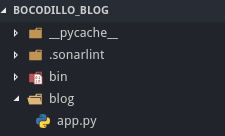

## Project Structure

We'll do some of the changes in our project. Firstly, we'll create a folder called **blog**. So, this folder will contain our project files.

Using this kind of structure, we can separate our projects. You can use any name for your project folder.

After that, we will move the **app.py** file into that folder.



## ASGI File

We'll create a file called **asgi.py** under the root folder.

It will be like that;

```python
from bocadillo import configure
from blog.app import app

configure(app)
```

## app.py File

We don't need to call configure method again inside this file. Because we called it in the **asgi.py** file. Let's change **blog/app.py** file.

```python
from bocadillo import App

app = App()

@app.route("/")
async def index(req, res):
    res.text = "Hello World!"
```

We just removed configure method. Now we can run our project like that;

```bash
uvicorn asgi:app --reload
```

Now it is more elegant :) I think this is very important because you don't want to put everything in one file. Nobody wants. Everything could be more complex in large projects.


The next thing will be about settings.