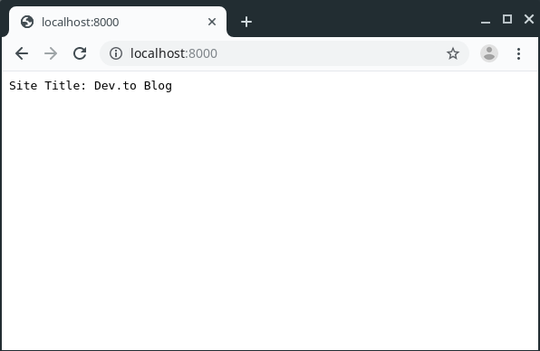

## Settings

Using Bocadillo, you may need to configure something. For example, you want to set allowed hosts for your API calls. `.env` files are good to save credentials.

This is an `.env` file;

```dotenv
DEBUG=True
DATABASE_URL=postgresql://localhost/myproject
SECRET_KEY=43n080musdfjt54t-09sdgr
ALLOWED_HOSTS=127.0.0.1, localhost
```

Don't commit `.env` file to your git project.

## settings.py File

Actually, the name doesn't matter. But we chose this name to easy understanding. You will store your constants like mailchimp secret key.

For example, we set default title for this blog and get it.

We'll create **settings.py** under the root folder.

```python
from starlette.config import Config

config = Config(".env")

REDIRECT_TRAILING_SLASH = True
```

We'll also create a **.env** file.

```dotenv
Title="Dev.to Blog"
```

For example, we want to access settings from the app.py file. We need to import it.

```python
from bocadillo import App

import settings
```

Now our app will change like that;

**asgi.py** file

```python
from bocadillo import configure
from blog.app import app

import settings

configure(app, settings)
```

**blog/app.py** file

```python
from bocadillo import App

import settings


app = App()

@app.route("/")
async def index(req, res):
    title = settings.config.get("Title")
    res.text = f"Site Title: {title}"
```

We can run our project now.



This isn't important yet. But we will need to use settings. Because we want to write reusable components. Our philosophy should be "write once, use everywhere".

You may want to separate layers of your project. Like data, entities, presentation etc.

You can skip this instruction.

